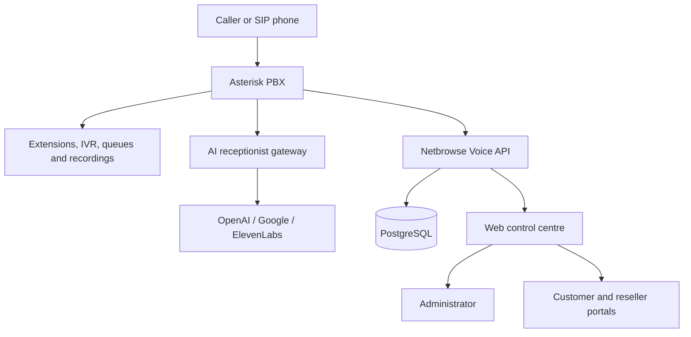

# Netbrowse Voice — Hackathon Brief

> One system. Every call.

## The problem

Small businesses, service providers and growing contact centres commonly stitch
together a PBX, IVR, call recording, AI voice tools, billing and customer
management from separate products. That makes deployment expensive, difficult
to manage and hard to resell.

## The solution

Netbrowse Voice is an AI-assisted communications platform that runs on one
Ubuntu server with Asterisk at its core. It brings PBX operations, AI
receptionists, voice generation, call queues, customer billing and multi-tenant
reseller portals into one control plane.

It is designed for an organisation to operate its own service, while customers
and resellers receive isolated portals that cannot see provider costs, platform
credentials or one another's data.

## What judges can see in the demo

1. Create or show two SIP extensions and make a live internal call.
2. Open **AI Receptionist**, call its internal test number and demonstrate a
   natural spoken response with an optional human handoff.
3. Open **Sound Studio** and **IVR Builder** to show how generated speech is
   converted to Asterisk-ready audio and used in a call flow.
4. Open **Live Calls**, **Call History** and **Recordings** to show operational
   visibility after a call completes.
5. Open **Customers** to show an isolated customer or reseller workspace,
   service allowances and white-label branding.
6. Open **DID Store** and the customer **Buy numbers** view to demonstrate
   provider inventory, customer pricing, automatic routing and recurring DID
   billing.

## Technical architecture

## What makes it different

- Asterisk-native telephony instead of a mock calling interface.
- AI receptionists that can answer calls and hand off to people.
- Provider-neutral AI voice generation, with OpenAI, Google and ElevenLabs
  options.
- A real multi-tenant model: administrator, agent, customer and reseller roles
  have separate authorised workspaces.
- Billing is designed into call records, rated calls, wallet controls, customer
  rate cards, invoices and recurring DID charges.
- The project is deployable through one idempotent Ubuntu installation script.

## Security and privacy choices

- SIP and provider secrets are encrypted at rest.
- Customer routes, recordings, calls, invoices, balances and rates are tenant
  scoped.
- Provider costs, platform credentials and other customers remain private.
- AI calls include a disclosure and bounded handoff behaviour.
- Generated Asterisk configuration passes through a narrow validation helper.

## Fast demo script (about 3 minutes)

1. **0:00–0:20 — Problem and dashboard**
   Explain that the platform unifies PBX, AI voice and customer operations.
   Show the health dashboard and the Quick Launch journey.
2. **0:20–1:10 — A real call**
   Call an extension or the AI receptionist from a registered softphone. Show
   the AI response or IVR, then the live-call view.
3. **1:10–1:50 — Build a voice flow**
   Show a generated Sound Studio announcement and the IVR or receptionist that
   uses it.
4. **1:50–2:30 — Operate it**
   Show call history, recordings and the customer/reseller separation.
5. **2:30–3:00 — Commercial model**
   Show the DID Store, customer marketplace and billing controls. End with the
   one-command Ubuntu deployment story.

## Verification completed

The 0.30.1 build has passed TypeScript checks, production web/API builds, 121 API
tests and all installer helper tests. The installer checks Asterisk voicemail,
recording, AudioSocket, queues, music on hold and PostgreSQL CDR support before
it reports success.

## Roadmap after the hackathon

- Customer DID cancellation, reassignment and porting workflow.
- Payment gateway support for wallet top-ups and DID checkout.
- Metered or subscription-based AI receptionist billing.
- Native iPhone and Android softphone applications.
